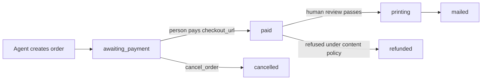

| Status | Meaning |
| --- | --- |
| `awaiting_payment` | Created. Nothing happens until the `checkout_url` is paid. The link never expires. |
| `paid` | In the review and print queue. |
| `printing` | Approved and being printed. |
| `mailed` | Handed to USPS First-Class. Delivery usually takes 3–5 business days. |
| `cancelled` | Cancelled before payment. Nothing was mailed. |
| `refunded` | Refused or cancelled after payment, and refunded in full. |

Most paid orders are mailed within one business day.

## Changing or cancelling

Unpaid orders: call `cancel_order` or simply never pay. Paid orders: email support with the order id before it is printed for a full refund.
